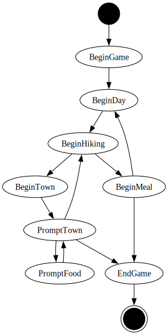

## Play me

The (unstable) development branch is tracked at

    ssh pct@pct.ahepp.dev

## States

    
## Feature requests

Please feel free to request or discuss features in the [issues tab](issues).
    
## Security 

If you manage to escape the shell or wreak havoc in some other way, I'd appreciate if you [email me](mailto:git@ahepp.dev).
I'll buy you a coffee/beer.
